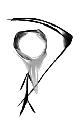

Actors
======

.. raw:: html

    <table>
        <tr>
            <td></td>
            <td></td>
            <td></td>
            <td></td>
            <td></td>
            <td></td>
        </tr>
    </table>

.. _actor-fact-checker:

Fact Checker
------------

The Fact Checker is responsible for getting the facts about a system.  It produces a :ref:`document-fact`.

.. _actor-prescriber:

Prescriber
----------

.. image:: prescriber.png
    :height: 100px

XXX to be defined

.. _actor-inspector:

Inspector
---------

The Inspector inspects the current state of resources.

It accepts an :ref:`document-identity` and returns an :ref:`document-observation` conforming to the schema for the given resource type.

For example, to inspect the state of the file ``/tmp/foo`` pass this document to the appropriate inspector:

.. code-block:: javascript

    {
        "kind": "file",
        "name": "/tmp/foo"
    }

The inspector will return a document conforming to the :ref:`file-observation-schema`:

.. code-block:: javascript

    {
        "kind": "file",
        "name": "/tmp/foo",
        "exists": true,
        "size": 3493,
        "sha": "c30a7f7531c41ec102fb5510d58166b502f68437",
        "user": "foo",
        "group": "bar",
        ...
    }

.. _actor-choreographer:

Choreographer
-------------

Takes the facts, prescription, observed state and lays out the steps.

.. _actor-performer:

Performer
---------

The Performer makes necessary changes to a machine in order to conform to a prescribed state.

It accepts a :ref:`document-prescription` and XXX what it returns is currently undefined.

For example, you might give it this prescription to ensure that the file at ``/tmp/foo`` exists and has attributes described:

.. code-block:: javascript

    {
        "kind": "file",
        "name": "/tmp/foo",
        "exists": true,
        "user": "jim",
        "group": "jimsgroup",
        "content": "This is the content of the file"
    }

.. _actor-historian:

Historian
---------

Collects logs and things.

